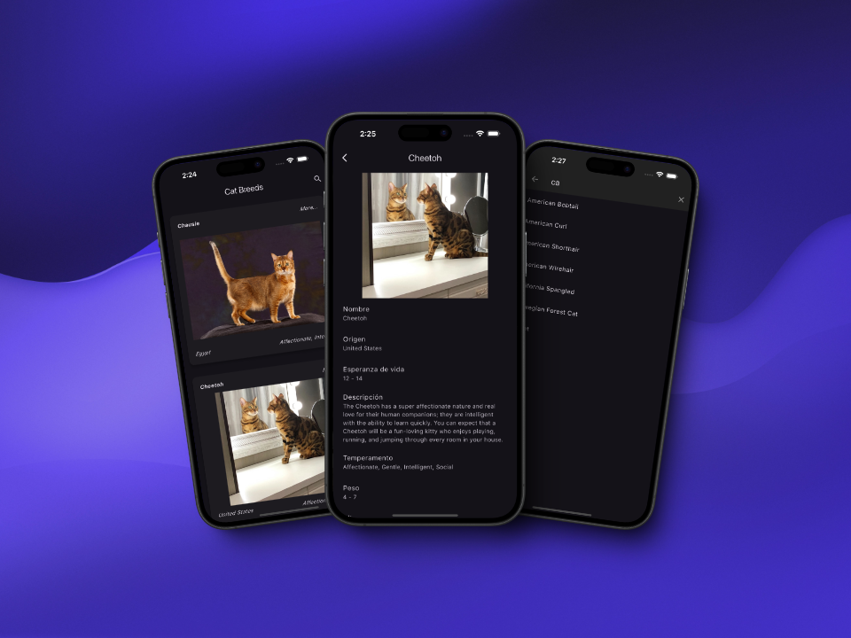

# The Cat API Challenge 🐱

This challenge is a simple flutter app that fetches data from the [Cat API](https://api.thecatapi.com/).



## Requirements

- Flutter 3.24.4
- Riverpod 1.0.3 `dart run build_runner watch`

## Running the app

1. Create .env file in the root directory of the project.

1. Add the following line to the .env

```dart
API_KEY=YOUR_API_KEY
```

1. Run the app using the following command

```dart
flutter run
```
